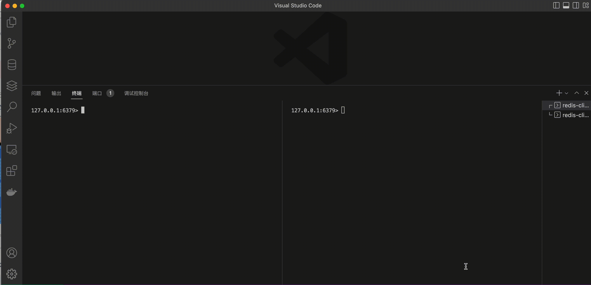
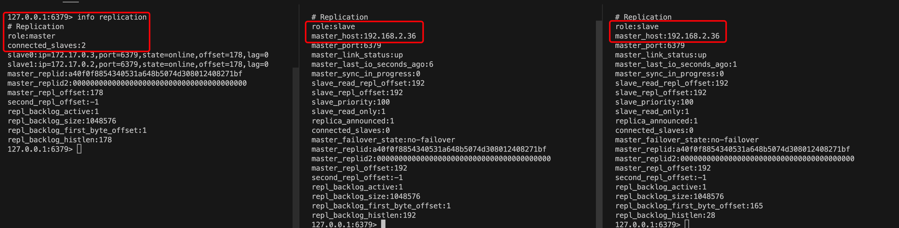

# Redis学习笔记

## NoSQL概述
NoSQL的意思是No only Sql,Nosql因为没有IO操作，数据存储在内存中，因此读写速度飞快
。NoSQL属于非关系型数据库，适用于 **对数据高并发读写、海量数据的读写、对数据高可扩展性**的场景。

## Redis概述＆安装
### 什么是Redis
Redis是一个开源的key-value数据库。Redis和Memcacahed类似，支持多种数据类型，如string,list,set,zet,hash；
Redis数据支持push/pop、add/remove操作并且都是原子性的；Redis支持Master-Slave主从同步。


### Redis的安装

### 在ubuntu下安装
    sudo apt update
    sudo apt upgrade
    sudo apt install redis-server

检查是否安装成功＆查看运行状态

    redis-cli --version
    
    systemctl status redis

### 使用Docker运行
    // 查看redis版本
    docker search redis
    
    // 获取最新的redis版本
    docker pull redis:latest
    
    // 查看本地镜像
    docker images
    
    // 运行redis的docker容器
    docker run -itd --name my-redis -p 6379:6379 redis
    
    // 查看容器运行状态
    docker ps
    
    // 用交互模式进入容器
    docker exec -it my-redis /bin/bash

### 编译安装
    //下载源码文件
    wget https://download.redis.io/redis-stable.tar.gz
    
    // 编译redis
    // 切换到根目录,然后运行make
    tar -xzvf redis-stable.tar.gz
    cd redis-stable
    make
    
    // 如果编译成功，则在src目录下多出两个redis二进制文件
    redis-server : Redis 服务器本身
    redis-cli : Redis 对话的命令行界面实用程序
    
    // 在 /usrl/local/bin 下编译二进制文件
    make run 
    
    // 启动redis
    redis-server


​    
## Redis的基本操作
### Redis的key操作
1. 查看库当前的key `keys *`
2. 判断某个key是否存在 `exists key`
   1. key存在 返回 （integer）1
   2. key不存在 返回 （integer） 0
3. 查看key的类型 `type key`
   1. key存在 返回 具体类型（string）
   2. key不存在 返回 none 
4. 删除指定key `del key`
   1. 删除成功 key 返回 (integer) 1
   2. 删除失败 key 返回 (integer) 0
5. 根据value选择非阻塞 `unlink key`
   1. 删除成功 key 返回 (integer) 1
   2. 删除失败 key 返回 (integer) 0
6. 设置key的过期时间 `expire key 10(s)`
   1. 设置成功 key 返回 (integer) 1
   2. 设置失败 key 返回 (integer) 0
7. 获取redis key过期时间
   1. `ttl key` 返回过期时间的秒数，如果不存在过期时间则返回-1，如果key不存在返回-2。
   2. `pttl key` 返回过期时间的毫秒数；其余跟`ttl key`相同。
8. 移除redis key的过期时间
   1. `persist key` 


## Redis五种数据类型
### String 字符串

#### String概述
String类型是二进制安全性的，意味着redis的string可以包含任何数据，如jpg或序列化对象；
在redis字符串中value最大可以是512M。

#### 什么是二进制安全
二进制安全的意思就是，只关心二进制化的字符串，不关心具体格式，只会严格的按照二进制的数据存取，不会妄图以某种特殊格式解析数据

#### 关于redis string的数据结构
内部为当前字符串分配空间capacity一般高于实际字符串长度len；当字符串长度小于1M时，扩容会加倍当前空间。
如果字符串长度超过1M,那么每次扩容只会增加1M空间。

#### Redis String 操作
##### SET
* `SET key value` 将字符串值关联到key,set相同的key会覆盖之前的value
* 可选参数
  * EX seconds  `SET key value EX seconds` 设置value的同时设置过期时间。
  * NX  `SET key value NX` 仅当key不存在时才能设置;执行成功返回1，否则返回0。
    * 设置成功返回OK,失败则返回nil

##### SETNX
* `SETNX key value`
* 仅当key不存在时才能设置成功

##### SETEX
* `SETNX key seconds value`
* 设置关联value，同时设置key的过期时间。

##### PSETEX
* `PSETEX key milliseconds value`
* 设置关联value，同时设置key的过期时间（微秒）

##### GET
* `GET key`
* 获取key关联的value值

##### GETSET
* `GETSET key value`
* 返回key被设置前的值，将key的值设为value

##### STRLEN
* `STRLEN key`
* 返回字符串value的长度

##### APPEND
*  `APPEND key value`
* 若key存在则在关联的值后追加value并返回字符串长度
* 若key不存在则跟 `SET`关键字作用一样

##### SETRANGE
* `SETRANGE key offset value`
* 从偏移量`offset`开始，用value参数覆写key存储的字符串value值
* 简单来说，偏移到哪位，就将这位的值设置为value


##### GETRANGE
* `GETRANGE key start end`
* 从key存储的字符串中截取从start到end的字符串

##### MSET
* `MSET key value key value`
* 同时设置多个key value
* 如果某个key已经存在，那么`MSET`将使用新值覆盖旧值

##### MGET
* `MGET key key key`
* 同时获取多个key的value

##### INCR 
* `INCR key`
* 将key中存储值数字加1（只能用于数字）

##### DECR
* `DECR key`
* 将key中存储值数字减1（只能用于数字）

##### INCRBY
* `INCRBY key value`
* 自定义增量（可以为负值）

### Set 集合
* Set 是一个集合
* Set 对外提供的功能与list类似是一个列表的功能，特殊之处在于set是可以自动重排的。
* Set有去重的功能

#### Redis SET操作
##### SADD
* `SADD key value value value ...`
* 将一个或多个member元素加入到集合key当中，如member已经存在将被忽略。
* 若key不存在，则创建一个只包含member元素成员的集合。

##### SMEMBERS 
* `SMEMBERS key`
* 查看集合key中所有成员，不存在的key被视为空集合
* 如查看不存在key k2

` 
    127.0.0.1:6379> smembers k2
    (error) WRONGTYPE Operation against a key holding the wrong kind of value
`

##### SISMEMBER 
* `SISMEMBER key member`
* 判断member是否在集合key的成员，若是返回1，否则返回0

##### SPOP
* `SPOP key`
* 移除并`随机`返回集合中的一个元素

##### SRANDMEMBER
* `SRANDMEMBER key [count]`
* 若不提供参数 `count` ,则返回一个随机元素
* 若提供参数 `count` 小于集合基数，那么会返回`count`个`随机`集合。
* 若提供参数 `count` 大于或集合基数，那么返回整个集合。
* 若提供参数 `count` 为负数，返回数组长度为`count`的绝对值，数组元素可能重复

##### SCARD

* ` SCARD key`
* 返回集合key中元素的数量

##### SREM

* `SREM key member member member ...`
* 移除集合key中一个或多个member元素，不存在的member元素将会被忽略

##### SMOVE

* `SMOVE source destination member`
* 将`member`元素从`source`集合移动到`destination`集合
* 操作完成后`source`集合`member`就被搬走了（没有了）

##### SUNION

* `SUNION key key ...` 
* 返回一个集合的全部成员，该集合是所有给定集合的并集
* 并集就是将两个集合并在一起的集合。

##### SUNIONSTORE

* `SUNIONSTORE destination key key ... `
* 这个指令类似于`SUNION`，但它将结果保存到`destination`集合

#### SET的数据结构

* SET是通过哈希表实现的


### Hash 哈希

* Hash是`键值对集合`
* redis Hash是一个`string`类型的`field`和`value`的映射表，Hash特别适用于存储对象。

#### Redis Hash 操作

##### HSET 

* `HSET hash field value field value ...`
* 将哈希表`hash`中域 `field`的值设置为`value`

##### HSETNX

* `HSETNX hash field value `
* 仅设置不存在的`field`，否则设置失败
* 设置成功返回1，失败返回0

##### HGET

* `HGET key field`
* 获取指定`key`中的`field`关联的值

##### HEXISTS

* `HEXISTS key field`
* 检查给定域field是否存在

##### HDEL 

* `HDEL key field  field ...`
* 可以删除单个域、多个域、不存在的键
* 删除成功返回1，否则返回0 

##### HLEN

* `HLEN key field`
* 返回哈希表key中域的数量

##### HSTRLEN

* `HSTRLEN key field`
* 返回哈希表key中，field关联值的字符串长度

##### HINCRBY

* `HINCRBY key field increment`
* 为哈希表`key`中域给定域field的值加上增量`increment`
* 只能是`integer`整形，不然报错`(error) ERR hash value is not an integer`

##### HINCRBYFLOAT 

* `HINCRBYFLOAT key field increment`
* 为哈希表`key`中域`field`加上浮点数增量`increment`

##### HMSET

* `HMSET key field value field value ...`
* 在哈希表`key`中同时设置多个值

##### HMGET

* `HMGET key field field field ...`
* 在哈希表中`key`中同时获取多个值
* 若`field`不存在则返回`nil`

##### HEKYS

* `HKEYS key` 
* 返回哈希表`key`中所有的域

##### HVALS 

* `HVALS key`
* 返回哈希表`key`中所有域的值

##### HGETALL

* `HGETALL key`
* 返回哈希表`key`中所有的域和值

##### HSCAN	

* `HSCAN key cursor [MATCH pattern] [COUNT count]`
* 字段
  * cursor 游标
  * Pattern 匹配的模式
  * count  指定从数据库力返回多少元素，默认值是0 
* 返回值：返回的每个元素都是一个元组，每一个元组元素由一个字段(field) 和值（value）组成。

#### 哈希表的数据结构

* 哈希表对应的数据结构有两种，一种是`ziplist`（压缩列表），另一种是`hashtable`（哈希表）
* 当`field-value`长度较短且个数比较少时，使用`ziplist`，否则使用`hashtable`
* ziplist：当哈希类型元素个数小于`hash-max-ziplist-entries`配置（默认512个），同时所有值都小于`hash-max-ziplist-value`配置（默认64个字节）时，Redis会使用`ziplist`作为哈希的内部实现`ziplist`使用更加紧凑的结构实现多个元素的连续存储，所以在节省内存方面比`hashtable`更加优秀。
* hashtable：当哈希类型无法满足`ziplist`的条件时，Redis会使用`hashtable`作为哈希的内部实现。因为此时`ziplist`的读写效率会下降，而`hashtable`的读写时间复杂度为O(1)。


### List 列表

- Redis列表是简单的字符串列表，按照插入顺序排序。可以添加一个元素到列表的头部（左边）或尾部（右边）。

- list的底层实现是双向链表，对两端的操作性很强，但随机访问性能较弱。


#### Redis的List操作

##### LPUSH /RPUSH

- `LPUSH / RPUSH key value value ...`

* ```
  127.0.0.1:6379> LPUSH k1 one two three
  (integer) 3
  127.0.0.1:6379> LINDEX k1 0 
  "three"
  127.0.0.1:6379> LINDEX k1 1
  "two"
  127.0.0.1:6379> LINDEX k1 2
  "one"
  ```

* 将一个或多个值插入到队列key的表头/尾

##### LPUSHX / RPUSHX

- `LPUSHX / RPUSHX key value value ...`
- 仅当`key`存在时才能插入`value`

##### LPOP / RPOP

- `LPOP / RPOP key `
- 从 左边/右边 移除并返回列表key的头元素 / 尾元素
- 到最后如果元素都没有了，那么key也不存在了

##### RPOPLPUSH 

- `RPOPLPUSH source destination`
- 命令`RPOPLPUSH`在一个原子时间内执行两个动作
  1. 将队列source中的尾元素弹出并返回客户端
  2. 将`source`弹出的元素插入到列表`destination`，作为`destination`列表的头元素

##### LRANGE 

- `LRANGE key start stop`
- 按照索引获得元素（从左往右）
- 获取全部元素 `LRANGE key 0 -1`


##### LREM

- `LREM key count element`
- 根据参数`count`的值，移除列表中与参数`element`相等的元素
- `count`的类型
  - `count > 0` 从表头开始向表尾搜索，移除与value相等的元素，数量为`count`
  - `count < 0` 从表尾开始向表头搜索，移除与`value`相等的元素，数量为`count`的绝对值
  - `count = 0` 移除表中所有与`value`相等的值


##### LLEN

* `LLEN key`
* 返回列表key的长度

##### LINDEX

* `LINDEX key index`
* 返回列表key中，下标为index的元素

##### LINSERT

* `LINSERT key BEFORE|AFTER pivot value`
* 将值value插入到列表key当中，位于值`pivot`之前或之后
* 当`pivot`不存在时， 不进行任何操作
* 当`key`不存在时,不进行任何操作
* 当`key` 不是列表类型时，返回错误

##### LSET

* `LSET key index value`
* 将列表`key`下标为`index`元素的值设置为`value`

##### LRANGE

* `LRANGE key start stop`
* 返回列表`key`中指定区间的元素，区间以偏移量`start`和`stop`指定
* 下标参数`start`和`stop`都以0为底，既0表示列表的第一个元素，-1表示列表最后的元素,-2表示列表倒数第二位的元素。

##### LTRIM

* `LTRIM key start stop`
* 只保留列表中从`start`到`stop`下标的元素

##### BLPOP / BRPOP / BRPOPLPUSH

* `BLPOP / BRPOP key timeout`

* `BLPOP`指令会移出并获取列表的第一个元素，若没有元素则会阻塞到`timeout`时间（秒），或期间发现有可弹出元素为止。

* `BRPOP`指令会移出并获取列表的最后一个元素，若没有元素则会阻塞到`timeout`时间（秒），或期间发现有可弹出元素为止。

* `BRPOPLPUSH source destination timeout`

* `BRPOPLPUSH`会弹出最后一个元素，并将元素插入到另一个队列的头部；若没有元素则会阻塞到`timeout`时间（秒），或期间发现有可弹出元素为止。

* ```
  127.0.0.1:6379> blpop k1 5
  (nil)
  (5.01s)
  ```

  

### Zset 有序集合

* Zset与普通集合set非常相似，是一个没有重复元素的字符串集合。
* 不同之处是有序集合Zset的每个成员都关联了一个评分(score)，这个评分(score)被用来按照最低分到最高分的方式排序集合中的成员。集合中的成员是唯一的，但评分是可以重复的。
* 因为元素是有序的，所以能根据`评分`或`次序`来获取一个范围的元素。

#### Redis的Zset操作

##### ZADD

* `ZADD key score member`
* 将一个或多个`member`元素和`score`值加入到有序集`key`当中

##### ZSCORE

* `ZSCORE key member`
* 返回有序集`key`中，成员`member`的`score`值

##### ZINCRBY

* `zincrby key increment member`
* 给`zset`中`key`的成员`member`的`socre`加上`increment`

##### ZCARD

* `ZCARD key`
* 返回有序集合key的基数

##### ZCOUNT

* `ZCOUNT key min max`
* 返回集合中`score`的值介于min和max之间（含等于）的成员数

##### ZRANGE

* `ZRANGE key start stop`
* 返回指定区间的成员`member`
* 成员位置按照`socre`值从小到大排序

##### ZREVRANGE

* `ZREVRANGE key start stop`
* 返回指定区间的成员`member`
* 成员位置按照`socre`值从大到小排序

##### ZRANGEBYSOCRE

* `ZRANGEBYSCORE key min max`
* 返回有序集 key 中，所有 score 值介于 min 和 max 之间(包括等于 min 或 max )的成员。有序集成员按 score 值递增(从小到大)次序排列。
* 可选参数
  * WITHSCORES  返回带分数
  * LIMIT offset count 

##### ZREVRANGEBYSCORE

*  `ZREVRANGEBYSCORE key min max`
* 返回有序集 key 中， score 值介于 max 和 min 之间(默认包括等于 max 或 min )的所有的成员。有序集成员按 score 值递减(从大到小)的次序排列。

##### ZRANK

* `ZRANK key member`
* 返回有序集 key 中成员 member 的排名。其中有序集成员按 score 值递增(从小到大)顺序排列。

##### ZREVRANK

* `ZREVRANK key member`
* 返回有序集 key 中成员 member 的排名。其中有序集成员按 score 值递增(从大到小)顺序排列。

##### ZREM

* `ZREM key member` 
* 移除有序集合key中的一个或多个成员，不存的成员将直接被忽略

##### ZREMRANGEBYRANK

* `ZREMRANGEBYRANK key start stop`
* 移除有序集 key 中，指定排名(rank)区间内的所有成员

##### ZREMRANGEBYSCORE

* `ZREMRANGEBYSCORE key min max`
* 移除有序集 key 中，所有 score 值介于 min 和 max 之间(包括等于 min 或 max )的成员。

##### ZRANGEBYLEX

* `ZRANGEBYLEX key min max`
* 当有序集合的所有成员都具有相同的分值时， 有序集合的元素会根据成员的字典序（lexicographical ordering）来进行排序， 而这个命令则可以返回给定的有序集合键 key 中， 值介于 min 和 max 之间的成员。

##### ZLEXCOUNT

* `ZLEXCOUNT key min max`
* 对于一个所有成员的分值都相同的有序集合键 key 来说， 这个命令会返回该集合中， 成员介于 min 和 max 范围内的元素数量。

## Redis 配置文件
### Redis配置文件目录
#### ubuntu
路径是 `/etc/redis/redis.conf`

### Redis常见配置
- bind 
  - 默认情况下，如果没有指定bind，redis会监听主机的所有可用网络接口。通过配置bind可以监听一个或多个网络端口
  -  bind 192.168.1.100 10.0.0.1   `监听两个IPV4端口`
  -  bind 127.0.0.1 ::1  `监听本地回环地址IPV4和IPV6`
- port 
  - 配置监听端口
- protected-mode 
  - 默认开启
  - 只有当你确认其他主机的客户端连接到Redis(即使没有验证身份)才应该禁用
  - 配置Redis集群时需要将protected-mode设置为禁用
- tcp-backlpg
  - 用于设置linux系统中控制TCP三次握手`已完成连接队列`的长度
  - 在高并发系统中，需要设置一个较高的`tcp-backlog`来避免客户端访问速度慢的问题
- timeout
  - 设置客户端空闲多少秒后关闭连接
  - 设置0为禁用
- tcp-keepalive
  - 设置`tcp-keepalive`的主要用途是心跳检测
  - 这个选项设置合理值为300
- supervised 
  - 设置redis的进程守护
  - 选项
    - no  没有监督
    - upstart  通过将Redis置于SIGSTOP模式来启动信号
    - systemd signal systemd将READY = 1写入$ NOTIFY_SOCKET
    - auto  检测upstart或systemd方法基于 UPSTART_JOB或NOTIFY_SOCKET环境变量
- pidfile 
  - `/var/run/redis/redis-server.pid`
  - 如果指定了pid文件，Redis会在启动时将其写入指定的位置
  并在退出时删除它
  - 如果在配置中没有指定pid文件，那么当服务器运行时，不会创建pid文件。当服务器被守护时，即使没有指定pid文件，也会使用pid文件，默认为"/var/run/redis.pid"
  - 创建一个pid文件是最好的努力:如果Redis不能创建它，没有什么不好的事情发生，服务器将正常启动和运行。
  - 注意，在现代Linux系统中，“/run/redis. conf”Pid”更符合要求，应该用它来代替。

- loglevel 
  - 指定redis服务级别
  - 选项
    - debug 大量信息，对开发/测试很有用
    - verbose 许多很少有用的信息，但不像调试级别那样混乱
    - notice 稍微有点啰嗦，可能是您在生产中想要的
    - warning 只记录非常重要/关键的消息
- databases 
  - 设置redis默认数据库数量
- maxclients
  - 设置最多客户端连接数
  - 默认是10000  


## Redis 订阅与发布

### 概述

Redis发布订阅(pub/sub)是一种消息通信模式，发送这(pub)发送消息，订阅者（sub）接收消息。Redis客户端可以订阅任何数量的频道。

### 实践

1. 打开两个redis客户端，客户端1输入指令 `subscribe channel  channel ...`
2. 客户端2输入指令 `publish channel message`

```
// 客户端1
127.0.0.1:6379> subscribe channel1 

// 客户端2
127.0.0.1:6379> publish channel1 "1 1 1"
(integer) 1

// 客户端1
1) "message"
2) "channel1"
3) "1 1 1"
```

## Go-Redis
### Github地址： `https://github.com/redis/go-redis`
### 概述
Go-Redis 是目前排名最高的 Go 语言版本的 Redis client，支持连接哨兵和集群模式的 Redis，并且提供了高级的Api封装，区别于另一个比较常用的 Go 语言 Redis client 库：Redigo，在服务集成过程中提供更多的功能支持，并且保障 Redis 数据类型安全支持。可以参考 go-redis 和 redigo 对比 去了解更多的差异。
### 演示
在文件夹go-redis-demo中，运行`go mod tidy`下载依赖包，并填好redis`ip地址`和`密码`运行就好了

### Redis pipelining
- Redis pipelining（流水线）是一种通过一次发出多个命令而无需等待对买个命令的相应来提高性能的技术。
- 大多数Redis客户端都支持pipelining。
#### 请求/响应协议和往返时间(RTT)
- Redis是一个TCP服务器，使用客户机-服务器模型和所谓的请求/响应协议。

这意味着通常通过以下步骤来完成请求:

客户端向服务器发送一个查询，并从socket中读取服务器响应，通常以阻塞的方式。
服务器处理命令并将响应发送回客户端。
例如，四个命令序列是这样的:

客户:INCR X
服务器:1
客户:INCR X
服务器:2
客户:INCR X
服务器:3
客户:INCR X
服务器:4
客户端和服务器通过网络链接连接。这样的链接可以非常快(环回接口)，也可以非常慢(在两台主机之间通过Internet建立的多跳连接)。无论网络延迟是多少，数据包从客户端到服务器以及从服务器返回到客户端以携带应答都需要时间。

这个时间称为RTT(往返时间)。当客户端需要在一行中执行许多请求时(例如向同一个列表中添加许多元素，或者用许多键填充数据库)，很容易看出这会如何影响性能。例如，如果RTT时间是250毫秒(在Internet上非常慢的链接的情况下)，即使服务器每秒能够处理100k个请求，我们每秒最多只能处理4个请求。

如果使用的接口是环回接口，则RTT要短得多，通常为亚毫秒级，但如果需要在一行中执行许多写入操作，则即使是这样，RTT也会增加很多。
#### Redis pipelining
可以实现一个请求/响应服务器，这样即使客户端还没有读取旧的响应，它也能够处理新的请求。这样就可以向服务器发送多个命令，而根本不需要等待响应，最后在一个步骤中读取响应。

这被称为流水线，是一种广泛使用了几十年的技术。例如，许多POP3协议实现已经支持这一功能，极大地加快了从服务器下载新邮件的过程。

Redis从早期就支持流水线，所以无论你运行的是什么版本，你都可以在Redis中使用流水线。

## Redis 新数据类型

## Redis的事务与锁机制
### Redis事务的定义和执行顺序
- Redis事务是一个单独隔离的操作，事务中所有命令都会被序列化、按顺序执行。事务在执行过程中不会被其他客户端发送过来的命令请求所打断。
- 一个事务从开始到执行会经历三个阶段
  1. 开始事务
  2. 命令入队
  3. 执行事务
- 当`组队阶段`发生失败（如输入执行有语法错误），任意一条指令失败则所有指令都不会执行；到了`执行阶段`则每条拼接的指令单独成功。
- 事务冲突解决思想
  - 乐观锁。每次读数据的时候认为别人不会修改，所以不会上锁。但更新的时候会判断在此期间别人有没有数据更新，使用版本号等机制。乐观锁适用于多读类类型，可以提高吞吐量。
  - 悲观锁。每次拿数据时都认为别人会修改，因此每次拿数据时都会上锁。
### Redis事务指令
#### Multi
Multi——组队命令

#### Exec
Exec——执行命令
####  discard
组队时能通过`discard`指令来放弃组队

```
127.0.0.1:6379> multi
OK
127.0.0.1:6379> set k1 v1
QUEUED
127.0.0.1:6379> get k1 
QUEUED
127.0.0.1:6379> sadd k2 one two three
QUEUED
127.0.0.1:6379> smembers k2
QUEUED
127.0.0.1:6379> exec
1) OK
2) "v1"
3) (integer) 3
4) 1) "three"
   2) "one"
   3) "two"
```


### Watch ＆ UnWatch

- Redis Watch命令用于监视一个（或多个）key，如果在事务执行之前key被其他命令所改动，那么事务将被打断。

```
//客户端1
127.0.0.1:6379> watch k1
OK
127.0.0.1:6379> set k1 v1
OK
127.0.0.1:6379> get k1
"v1"
127.0.0.1:6379> multi
OK
127.0.0.1:6379> set k1 v2
QUEUED
127.0.0.1:6379> get k1
QUEUED
127.0.0.1:6379> 

```

```
// 客户端2
127.0.0.1:6379> set k1 v50
OK
127.0.0.1:6379> 
```

```
// 客户端1
127.0.0.1:6379> exec
(nil)
```


## 持久化操作

#### 概述

Redis将数据保存到内存中，带来的好处是Redis的读写效率非常高。但同样缺点也很明显，一旦遇到宕机或断电，内存中的数据将会全部丢失。于是Redis持久化即将内存数据持久化到硬盘文件，以及通过备份文件来恢复数据。Redis通过`RDB`和`AOF`进行持久化操作。

### RDB
RDB持久化方案是按照指定时间间隔对你数据集生成的时间点快照（point-to-time snapshot）。它以紧缩的二进制文件保存Redis数据库某一时所有数据对象的内存快照。


### RDB配置
`save seconds changes`
- 如果给定的秒数和给定的操作都发生了，Redis就会保存数据库
- save 3600 1 (一小时后，如果至少有一个键改变Redis会保存DB)
- save 300 100 (5分钟后，如果至少有100个键改变Redis会保存DB)
- 手动执行备份使用`save`,自动间隔执行`bgsave`
- `save`命令会阻塞Redis服务器进程，服务器进程在RDB文件创建完成之前是不能处理任何命令请求的
- `bgsave`则会`fork`一个子进程，然后该子进程会负责创建RDB文件，服务器进程会继续处理请求。

`dbfilename dump.rdb`
- 配置保存数据库的文件名称

`dir ./`
- 工作目录

#### RDB备份过程

- Redis会单独创建(fork)一个子进程来进行持久化，会先将数据写入到一个临时文件中，待持久化过程都结束了，再用这个临时文件替换上次持久化好的文件。整个过程中，主进程是不进行任何IO操作的，这就确保极高的性能。如果需要大规模数据的恢复，且对数据恢复的完整性不是特比敏感，那RDB比AOF方式更加高效，RDB的缺点是最后一次持久化的数据可能丢失。
- 默认情况下如果启用RDB并且最近的后台保存失败，redis将停止接受写入。如果后台保存进程重新开始工作，redis将自动允许再次写入。
  - 通过设置` stop-writes-on-bgsave-error yes/no`    


### AOF
AOF（Append Only File），是以日志的形式来记录每个写操作（增量保存），将Redis执行过的所有指令记录下来（读操作不记录），只许追加文件不可以改写文件。Redis启动之后会读取该文件并重新构建数据。Redis冲后后根据日志文件内容从前到后执行一遍以完成数据恢复工作。

#### AOF配置
`appendonly yes`

### RDB VS AOF
`https://redis.io/docs/management/persistence/`
#### RDB优点：
1. RDB是Redis数据的一个非常紧凑的单文件时间点表示。 RDB文件非常适合备份。例如，您可能希望在最近24小时内每小时存档RDB文件，并在30天内每天保存RDB快照。这允许您在发生灾难时轻松地恢复数据集的不同版本。
2. RDB非常适合于灾难恢复，它是一个紧凑的文件，可以传输到远端的数据中心，也可以传输到Amazon S3(可能是加密的)。
3. RDB最大化了Redis的性能，因为Redis父进程需要做的唯一工作就是创建一个子进程来完成其余的工作。父进程永远不会执行磁盘I/O或类似的操作。
4. 与AOF相比，RDB允许更快地重新启动大数据集。
5. 在副本上，RDB支持重启和故障转移后的部分重新同步。

#### RDB缺点：
1. 如果你需要在Redis停止工作(例如断电后)时尽量减少数据丢失的机会，RDB不是很好。您可以在生成RDB的位置配置不同的保存点(例如，在至少5分钟并对数据集进行100次写入之后，您可以拥有多个保存点)。然而，你通常每五分钟或更久就会创建一个RDB快照，所以万一Redis因为任何原因停止工作而没有正确关闭，你应该准备好丢失最近几分钟的数据。

2. RDB经常需要fork()，以便使用子进程在磁盘上持久化。如果数据集很大，fork()可能会很耗时，如果数据集非常大，CPU性能不佳，可能会导致Redis停止服务客户端几毫秒甚至一秒。AOF也需要fork()，但频率较低，您可以调整您想要重写日志的频率，而不需要任何持久性的权衡。

#### AOF优点：
1. 使用AOF Redis更持久:你可以有不同的fsync策略:根本没有fsync，每秒钟fsync，每查询fsync。在默认的每秒fsync策略下，写性能仍然很好。Fsync是使用后台线程执行的，主线程在没有Fsync正在进行的时候会努力执行写操作，所以你只能损失一秒钟的写操作。
2. AOF日志是一个只能追加的日志，因此在停电时不存在寻标问题，也不存在损坏问题。即使由于某些原因(磁盘已满或其他原因)，日志以写了一半的命令结束，redis-check-aof工具也能够轻松地修复它。
3. 当AOF在后台变得太大时Redis能够自动重写。重写是完全安全的，因为当Redis继续追加到旧文件时，一个全新的文件会用创建当前数据集所需的最小操作集产生，一旦第二个文件准备好，Redis就会切换这两个文件并开始追加到新文件。
4. AOF以易于理解和解析的格式包含所有操作的一个接一个的日志。您甚至可以轻松地导出AOF文件。例如，即使您不小心使用FLUSHALL命令刷新了所有内容，只要在此期间没有执行重写日志，您仍然可以通过停止服务器、删除最新命令并重新启动Redis来保存数据集。

#### AOF缺点：
1. 对于相同的数据集，AOF文件通常比等效的RDB文件大。
2. AOF可能比RDB慢，这取决于确切的fsync策略。一般来说，将fsync设置为每秒一次，性能仍然非常高，禁用fsync，即使在高负载下，它也应该和RDB一样快。RDB仍然能够提供更多关于最大延迟的保证，即使在巨大的写负载的情况下。

#### 那我应该怎么用？
如果你想要达到PostgreSQL所能提供的数据安全程度，那么你应该同时使用这两种持久性方法。

如果您非常关心您的数据，但仍然可以忍受灾难发生时几分钟的数据丢失，那么您可以只使用RDB。

有许多用户单独使用AOF，但我们不鼓励这样做，因为不时地使用RDB快照对于进行数据库备份、快速重启以及在AOF引擎中出现错误时是一个很好的主意。


## 主从复制
### 概述
- 主从复制指的是将一台Redis服务器的数据，复制到其他Redis服务器。前者被称为主节点(master)，后者被称为从节点(salve)
- 数据的复制是单向的，只能从主节点复制到从节点。
### 主从复制的作用
1. 数据冗余：主从复制实现了数据的热备份，是持久化之外的一种数据冗余方式
2. 故障恢复：当主节点出现问题是，可以由从节点提供服务，实现快速的故障恢复；实际上是一种服务的冗余。
3. 负载均衡：在主从复制的基础上，配合读写分离，可以由主节点提供些服务，由从节点提供读服务。实现服务器负载均衡；通过多个从节点负担负载能提高Redis服务器的并发量。
4. 高可用。主从复制是哨兵模式和集群的基础。

### 主从复制操作
- 主从复制是由`从节点`发起的，主几点啥都不用干。
- 有三种方式进行主从复制:
1. 在配置文件中配置 `slaveof masterip masterport`
2. 在启动时配置 在启动命令后加入 `--slaveof masterip masterport`
3. 启动后在客户端通过指令配置 `slaveof masterip masterport`



 --- 
 
 --- 

### 主从模式的特点
#### 优点：
1. 当主节点宕机，从节点作为备份能继续提供服务
2. 读写分离，分担主节点压力

#### 缺点：
1. 主节点宕机时重新选主节点需要人工干预
2. 主节点的写能力受到单机限制


#### 注意事项
- 在主从复制模式时主机如果有要求密码`requirepass`要么注释掉，要么设置`masterauth` 
- `# masterauth <master-password>`,否则节点无法工作。
- 在主从模式中，主节点宕机后重启仍然是主节点。

### 哨兵模式
- 哨兵模式就是在一主多从的集群环境中，如果主节点宕机，那么将自动在从节点中选出一个新的主节点，并且剩余的从节点（slave）配置文件会自动修改（无需人为干预）

#### 搭建哨兵模式步骤
- 我这里情况有点特殊，Redis主节点在物理机上运行，其余两个从节点和三个哨兵使用docker运行。
1. 运行主节点
2. 使用docker搭建从节点
   1. 修改配置文件
      ```
      cd /home 
      mkdir redis && cd redis
      mkdir config && cd config
      touch redis6380.conf redis6381.conf
      chmod 777 redis*
       
      cd /home/redis && mkdir data && cd data
      mkdir data6380 data6381
      
      ```
      将以下配置分别写入到redis6380.conf和redis6381.conf上,主要是修改`port`
       ```
       protected-mode no
       daemonize no
       port 6380 
       slaveof masterip masterport
       ```
   2. 使用docker启动两台从机（slave）
   ```
   docker run \
   -p 6380:6380 \
   --name salve1-redis \
   -v /home//data6380:/data \
   -v /home/redis/config/redis6380.conf:/etc/redis/redis.conf \
   -v /etc/localtime:/etc/localtime \
   -d redis:6.2 redis-server /etc/redis/redis.conf
   
    docker run \
    -p 6381:6381 \
    --name salve2-redis \
    -v /home/docker-data/redis6381:/data \
    -v /home/redis/config/redis6381.conf:/etc/redis/redis.conf \
    -v /etc/localtime:/etc/localtime \
    -d redis:6.2 redis-server /etc/redis/redis.conf
   ```
3. 使用docker搭建哨兵模式
   1. 创建配置文件
   ```
   cd /home/redis/config
   touch sentinel-26379.conf sentinel-26380.conf sentinel-26381.conf 
   ```
   将以下内容分别改写到相应的配置文件中
    ```
    port 26379
    sentinel monitor mymaster <masterip> <masterport> 2
    ```
   
   2. 使用Docker启动哨兵
   ```
   docker run \
    --name sentinel-26380 \
    -p 26380:26380 \
    -v /home/redis/config/sentinel-26380.conf:/etc/redis/sentinel.conf \
    -v /etc/localtime:/etc/localtime \
    -d redis:6.2 redis-sentinel /etc/redis/sentinel.conf
   ```

#### 将master节点关掉，哨兵模式重新选举新的master节点

#### 重启旧的master节点

## 使用Docker-compose搭建Redis集群

```
cluster-enabled yes
cluster-config-file nodes-6371.conf
cluster-node-timeout 5000
appendonly yes
protected-mode no
cluster-announce-ip 192.168.2.36
cluster-announce-port 6371
cluster-announce-bus-port 16371
port 6371
```

```
redis-cli --cluster create 192.168.2.36:6371 \
192.168.2.36:6372 \
192.168.2.36:6373 \
192.168.2.36:6374 \
192.168.2.36:6375 \
192.168.2.36:6376 \
--cluster-replicas 1
```

## 异常处理
### 缓存雪崩
#### 原因
由于原有缓存失效，新缓存未到的时候，如设置缓存采用了相同的过期时间，在同一时刻出现大面积的缓存过期，
那么本来访问缓存的请求都去查询数据库了，对CPU和内存造成巨大压力，严重会造成数据库宕机。从而形成一系列连锁反应，造成整个系统崩溃。
#### 解决方案
1. 大多数系统设计者考虑用加锁或者队列的方式避免大量线程对数据库一次性读写，导致失效时大量并发请求落到底层存储系统上
2. 将缓存失效时间分开。
3. 使用熔断机制。当流量到达一定阈值时，就直接返回"系统繁忙"之类的提示，防止过多的请求打在数据库上。至少能保证一部分用户是可以正常使用，其他用户多刷新几次也能得到结果。
4. 提高数据库的容灾能力，可以使用分库分表，读写分离的策略。
5. 搭建Redis集群，提高Redis的容灾性。


### 缓存击穿(失效)
#### 原因
高并发流量，访问的这个数据是热点数据，请求的数据在 DB 中存在，但是 Redis 存的那一份已经过期，后端需要从 DB 从加载数据并写到 Redis。
#### 解决方案
1. 对于热点数据，我们不设置过期时间，这样就可以把请求都放在缓存中处理，充分把 Redis 高吞吐量性能利用起来。或者过期时间再加一个随机值。
2. 预热。将热门数据提前存入Redis，并设置热门数据的过期时间超大只。
3. 使用锁。

### 缓存穿透
#### 原因
- 意味着有特殊请求在查询一个不存在的数据，即数据不存在 Redis 也不存在于数据库。
- 导致每次请求都会穿透到数据库，缓存成了摆设，对数据库产生很大压力从而影响正常服务。
#### 解决方案
- 缓存空值：当请求的数据不存在 Redis 也不存在数据库的时候，设置一个缺省值(比如：None)。当后续再次进行查询则直接返回空值或者缺省值。
- 布隆过滤器：在数据写入数据库的同时将这个 ID 同步到到布隆过滤器中，当请求的 id 不存在布隆过滤器中则说明该请求查询的数据一定没有在数据库中保存，就不要去数据库查询了。


### 缓存降级
- 缓存降级是指缓存失效或者缓存服务器挂掉的情况下，不去访问数据库，直接返回默认数据或者访问服务的内存数据。
- 如双十一时淘宝无法修改地址，是为了保证订单正常提交和付款，不允许地址修改能降低服务器压力。
- 降级一般是有损操作，所以尽量减少降级对业务的影响程度。


## Redis实战
### 使用Redis构建网络应用