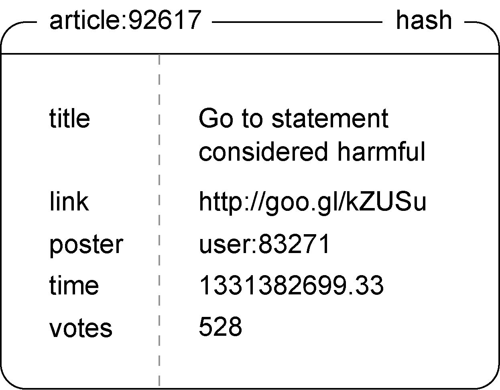

## 《Redis实战》笔记
这个文件记录的是《redis实战》的学习笔记 
- 图书中的github地址：https://github.com/josiahcarlson/redis-in-action/
- Go代码地址：https://github.com/josiahcarlson/redis-in-action/tree/master/golang

## 做一个对文章投票的网站demo
- 要构建一个文章投票网站，我们首先要做的就是为了这个网站设置一些数值和限制条件：
1. 如果一篇文章获得了至少200张支持票（up vote），那么网站就认为这篇文章是一篇有趣的文章；
2. 假如这个网站每天发布1000篇文章，而其中的50篇符合网站对有趣文章的要求，那么网站要做的就是把这50篇文章放到文章列表前100位至少一天；
3. 另外，这个网站暂时不提供投反对票（down vote）的功能。
4. 为了产生一个能够随着时间流逝而不断减少的评分，程序需要根据文章发布的时间和当前时间来计算文章的评分。

- 构建文章投票网站除了需要计算文章评分之外，害需要使用redis结构存储网络上的各种信息
1. 对于网站里的每篇文章，程序都使用一个散列表来存储文章的标题、指向文章的网站、发布文章的用户、文章的发布时间、文章投票数等等。

2. (:)来分隔名字的不同部分，如键名article:92617就使用了冒号来分隔单词article和文章ID号92617,以此来构建命名空间。

- 文章投票网站将两个有序集合来存储文章，一个有序集合的成员为文章ID，分值为文章的发布时间。第二个有序集合的成员同样为文章ID，而分值为文章的评分。
1. 通过这两个有序集合，网站既可以根据文章发布顺序来展示文章，又能通过评分高低来展示文章。
2. 为了防止用户对同一篇文章进行多次投票，网站需要为每一篇文章记录一个已投票用户名单。

- 发布并获取文章
1. 发布一篇新文章首先需要创建一个新的文章ID，这项工作可以通过一个计数器执行`INCR`命令来完成。接着程序需要使用`SADD`将文章发布者的ID添加到记录文章已投票用户的集合里。
并使用`EXPIRE`命令为这个集合设置一个过期时间，过期后自动删除。

- 如何取出评分最高的文章和最新发布的文章
1. 程序需要先试用`ZREVRANGE`命令取出多个文章ID，然后再对每个文章ID执行一次`HGETALL`命令来取出文章详细信息。